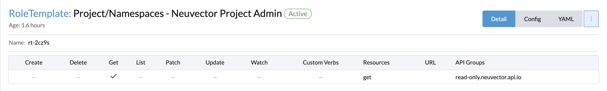
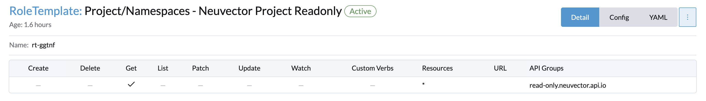
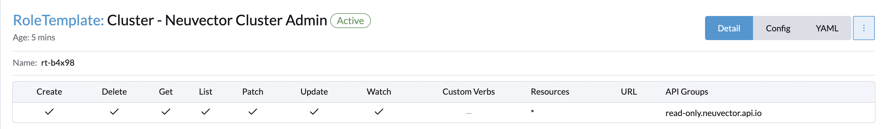

# Rancher + Neuvector RBAC integration
## _DRAFT_

Rancher release notes currently state that cluster admin, and global admin will be auto mapped to be global admins within Neuvector. In order to map other personas some access will need to be provided to the rancher user/group depending on the access necessary within Neuvector.

The following table lists the Neuvector role and the k8s rbac from which it is derived. These rbac mappings need to be created within rancher RBAC.

|Neuvector role|apiGroup |resources|verbs|comment|
|-----|-----|-----|-----|-----|
cluster admin|read-only.neuvector.api.io|*|*| clusterrole(with clusterrolebinding)|
cluster reader|read-only.neuvector.api.io|*|get| clusterrole(with clusterrolebinding)|
namespace admin|read-only.neuvector.api.io|*|*| clusterrole/role with rolebinding) via project|
namespace readonly|read-only.neuvector.api.io|*|get| clusterrole/role with rolebinding) via project|

### Creating the rancher RBAC roles for cluster and project scope
_for users that are not global admins or cluster admins_

Two items are necessary for the mapped access:
1. Global, Cluster, or project level role based on the above table
2. Project level services/proxy permissions for non global users/groups (for UI proxy via rancher).

Item 1 is highly dependent on your RBAC setup, but can be done with distinct Neuvector roles, or adding the permissions from the above tables to an existing set of custom roles. These can be given to users at Global, cluster, or project level. See[^1]. for example roles.

For item 2:
1. Create a project for Neuvector prior to installing from the App catalog, and install to this project. If install has already been done, create the project and move the namespace there. (need to update https://rancher.com/docs/rancher/v2.6/en/neuvector-integration/).
2. Create a project level role per rancher documentation with service/proxy access[^2]. 
3. Add the created project role to the created Neuvector project for any non global user/group that will be authenticating in this manner.
   
> **Warning**
> Please be sure to scope this role to a Neuvector only project, otherwise potential undesired service access could be given.

### Cluster Proxy Link + access
Currently the proxy link only is displayed for rancher admin users. So an admin will need to provide the link to other users. Once a user is logged into rancher, they can then access this link directly via bookmark or other method. _This will need a FR in rancher to display for other users_

## Example script to create project and cluster roles via API
See [add roles script](bin/add.sh)

[^1]: 
  
  
  
  
[^2]: 
