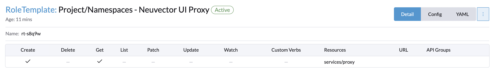

# Rancher + Neuvector RBAC integration
## _DRAFT_

### Pre-Reqs:
NeuVector installed into cattle-neuvector-system namespace on a downstream cluster with rancher SSO enabled. If using the app catalog, this will work out of the box.

The following table lists the Neuvector role and the k8s rbac from which it is derived. These rbac roles need to be created within rancher RBAC.

|Neuvector role|apiGroup |resources|verbs|comment|
|-----|-----|-----|-----|-----|
cluster admin|read-only.neuvector.api.io|*|*| clusterrole(with clusterrolebinding)|
cluster reader|read-only.neuvector.api.io|*|get| clusterrole(with clusterrolebinding)|
namespace admin|read-only.neuvector.api.io|*|*| clusterrole/role with rolebinding) via project|
namespace reader|read-only.neuvector.api.io|*|get| clusterrole/role with rolebinding) via project|
n/a|neuvector.com|*|get|necessary along with any of the above for nav link to appear|

### Creating the rancher RBAC roles for cluster and project scope
_for users that are not global admins or cluster admins_

Two items are necessary for the mapped access:
1. Cluster, or project level role with the above rbac objects.
2. Project level services/proxy permission for users that do not have this in another role (for UI proxy via rancher).

Item 1 is highly dependent on your RBAC setup, but can be done with distinct Neuvector roles, or adding the permissions from the above tables to an existing set of custom roles. These can be given to users at Global, cluster, or project level. See[^1]. for example roles.

For item 2:
1. Create a project for NeuVector prior to installing from the App catalog, and install to this project. If install has already been done, create the project and move the cattle-neuvector-system namespace there.
2. Create a project level role per rancher documentation with services/proxy access. 
3. Add the created project role to the created Neuvector project for any non global user/group that will be authenticating in this manner[^2].
   
> **Warning**
> Please be sure to scope this role to a Neuvector only project, otherwise potential undesired service access could be given. If using the API role add method, the role contains an extra restriction to ONLY the NeuVector UI service, which is not possible to add via rancher UI as of this writing.

## Example script to create project and cluster roles via API
See [add roles script](add.sh)

[^1]: 
  
  
  
  
  
[^2]: 
